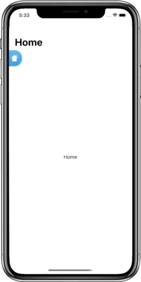

# SwiftUIDrag

A simple and intuitive wrapper-view enabling dragging, floating, and/or collapsing for its content.  Written entirely in SwiftUI, SwiftUIDrag is inspired by iOS 14's FaceTime Picture-in-Picture feature.

  

## Table of Contents
- [Usage](#usage)
- [Key Features](#key-features)
    - [Alignment](#alignment)
    - [Floating](#floating)
    - [Collapse](#collapse)
    - [Visible Size](#visible-size)
    - [Content](#content)
- [Installation](#installation)
- [License](#license)

## Usage 

```swift
SDView(floating: .leading, collapse: .trailing) { geo, state in
    RoundedRectangle(cornerRadius: 25)
        .fill(Color.blue)
        .frame(width: geo.size.width / 2, height: geo.size.height / 4)
        .overlay(
            HStack {
                Image(systemName: "chevron.left")
                .foregroundColor(.white)
                .frame(width: 10, height: 20)
                .opacity(state.isCollapsed && state.isTrailing ? 1 : 0)
                .padding(.leading)
                
                Spacer()
            }
        )
}
```
The above code enables the capabilities seen in the blue rectangle demo above.

## Key Features

Below is the default initializer which ***requires*** you to enter only one parameter: the content to inherit the SDView drag, floating, and/or collapse properties. The remaining parameters all have default values that can be left as is or customized for your use-case.

```swift
SDView(
    alignment: Alignment = .center,
    floating: SDFloatingOptions = [],
    collapse: SDCollapseOptions = .horizontal,
    visibleSize: CGSize = CGSize(width: 60, height: 60),
    @ViewBuilder content: @escaping (GeometryProxy, SDContentState) -> Content
)
```
The quickest way to get started is with the default paramters as such:

```swift
SDView { _, _ in
    // your content.
}
```

### Alignment

The `alignment` parameter allows you to position your content based on SwiftUI's  `Alignment` struct. By default, it is set to `center` which positions your content in the center of SDView. Thus, you get access to the following options:

| Options | 
| ----- | 
| `topLeading` |
|`top` | 
|`topTrailing` |
| `leading` |
|`center` | 
|`trailing` |
| `bottomLeading` | 
|`bottom` |
|`bottomTrailing` |

### Floating

The `floating` parameter enables you to float your content on the edges of the SDView. By default, it is set to `[]` which disables floating. Customization is at the heart of this package, thus you get access to the following options:

| Option | Description |
| -------- | ------------ |
| `[]` | disbales floating |
| `topLeading` | enables floating content on the top-leading side of SDView |
| `topTrailing` | enables floating content on the top-trailing side of SDView |
| `bottomLeading` | enables floating on the bottom-leading side of SDView |
| `bottomTrailing` | enables floating on the bottom-trailing side of SDView |
| `top` | enables floating content on either the top-leading or top-trailing sides of SDView |
| `bottom` | enables floating content on either the bottom-leading or bottom-trailing sides of SDView |
| `leading `| enables floating content on either the top-leading or bottom-leading sides of SDView |
| `trailing` | enables floating content on either the top-trailing or bottom-trailing sides of SDView |
| `all` | enables floating content on either the top-leading, top-trailing, bottom-leading, bottom-trailing sides of SDView |


### Collapse

The `collapse` parameter enables you to collapse your content into the sides of the SDView with a set `visibleSize`. By default, it is set to `horizontal` which only enables collapsing on the `leading` and `trailing` sides. Customization is at the heart of this package, thus you get access to the following options:

| Option | Description |
| -------- | ------------ |
| `[]` | disables collapsing |
| `top` | enables collapsing content on the top side of SDView |
| `bottom` | enables collapsing content on the bottom side of SDView |
| `leading` | enables collapsing on the leading side of SDView |
| `trailing` | enables collapsing on the trailing side of SDView |
| `horizontal` | enables collapsing content on either the leading or trailing sides of SDView |
| `vertical` | enables collapsing content on either the top or bottom sides of SDView |
| `all` | enables collapsing content on either the top, bottom, leading, trailing sides of SDView |

### Visible Size

The `visibleSize` parameter determines how much width or height of your content should be visible upon collapse. By default it is set to 60 for both. 

### Content

The `content` parameter is  `@escaping` and `@ViewBuilder`-wrapped which allows you to escape it into curly braces for you to easily describe your content in. Additionally, you get two callback parameters: `GeometryProxy` and `SDContentState`. 

The `GeometryProxy` enables you to customize any framing, positioning, and/or sizing based on the SDView. 

The `SDContentState` parameter indicates the state of your content. Once again, customization is at the heart of this package, so you get the following state options:

| Option | Description |
| -------- | ------------ |
| `top` | content is collapsed on the top side of SDView |
| `bottom` | content is collapsed on bottom side of SDView |
| `leading `| content is collapsed on leading side of SDView |
| `trailing` | content is collapsed on trailing side of SDView |
| `topLeading` | content is floating on top-leading side of SDView |
| `topTrailing` | content is floating on top-trailing side of SDView |
| `bottomLeading` | content is floating on the bottom-leading side of SDView |
| `bottomTrailing` | content is floating on the bottom-trailing side of SDView |
| `expanded` | content is neither collapse nor floating on any side of SDView |

To take it a step further, you also get access to `Bool` variables that allow for *swift* verification of the content state:

| Option | Description |
| -------- | ------------ |
| `isTop` | content is either collapsed or floating on the top side of SDView |
| `isBottom `| content is either collapsed or floating on the bottom side of SDView |
| `isLeading` | ontent is either collapsed or floating on the leading side of SDView  |
| `isTrailing` | ontent is either collapsed or floating on the trailing side of SDView |
| `isCollapsed` | content is collapsed in SDView |
| `isFloating` | content is floating in SDView |
| `isExpanded` | content is expanded |

## Installation

SwiftUIDrag can be installed via Swift Package Manager (SPM) in Xcode:

1. Navigate to the SPM (**File > Swift Packages > Add Package Dependency...**)
2. Either enter the url (**https://github.com/demharusnam/SwiftUIDrag**) or the name of the package with myself as the owner in the search bar.

## Author

At the time of publishing SwiftUIDrag, I am a computer engineering student from Toronto, Canada. I love Swift, SwiftUI and creating software.

If you have any questions regarding SwiftUIDrag, please feel free to contact [me](https://github.com/demharusnam). 

Happy hacking!

## License

SwiftUIDrag is available under the MIT license. See LICENSE for more information.
